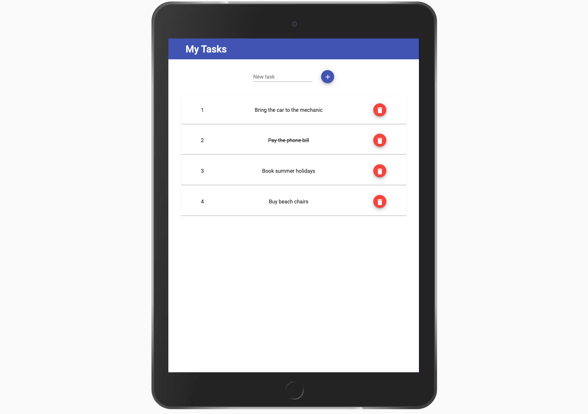

# TodoApp
Single page application where we can add new tasks, cross them, and delete them. 
Build with Angular 12.0.0.

### Screenshots
   
   
   

## Setup
1. Fork and clone this repository. 
2. Install dependencies with `npm install`.
3. In the terminal, `cd` into `todo-app`. Run `ng serve` for a dev server.
4. Go to `http://localhost:4200/` in your browser.

## Dependencies
- Angular 12.0.0
- Node v14.15.5
- Angular Material
